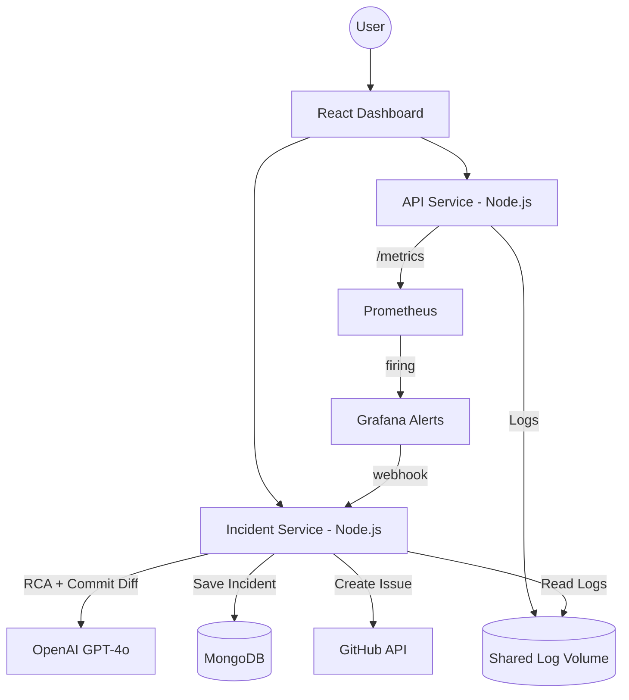

# ⚡ AI-Powered Incident Detection & Auto-Remediation System

> **A state-of-the-art SRE automation platform** that simulates complex business failures, leverages Prometheus for real-time observability, and uses LLMs (GPT-4o) to perform autonomous root cause analysis and GitHub issue automation.

---

## 🎯 Mission & Objectives

The goal of this project is to demonstrate a **next-generation SRE (Site Reliability Engineering) workflow** where human intervention is minimized during the initial stages of an incident. 

### What we are achieving:
- **Proactive Observability**: Transitioning from "waiting for reports" to "detecting anomalies" using Prometheus and Grafana.
- **Autonomous Root Cause Analysis (RCA)**: Using AI to ingest logs, commit history, and system state to provide a high-confidence diagnosis in seconds.
- **Automated Documentation**: Reducing manual overhead by automatically creating detailed GitHub issues with suggested fixes.
- **Realistic Chaos Engineering**: Simulating granular business failures (e.g., payment timeouts, inventory locks) rather than simple crash loops.
- **Interactive Command Center**: Providing a unified React dashboard to visualize system health and trigger manual failure simulations.

---

## 🏗 System Architecture

The system is built as a microservices-based monorepo, designed for scalability and clear separation of concerns.



### Key Components:
1.  **API Service**: The "victim" application. It serves business logic but is intentionally unstable, logging detailed JSON errors to a shared volume.
2.  **Incident Service**: The "brains". It listens for alerts, gathers context (logs + git diffs), consults the LLM, and orchestrates remediation.
3.  **Observability Stack**: Prometheus scrapes metrics; Grafana manages alerting thresholds and visualization.
4.  **Dashboard**: A premium React-based UI for monitoring incidents and simulating failures.

---

## 🔄 The Incident Lifecycle

### 1. Failure Simulation (The Spark)
Originally designed with random failures, the system now prioritizes **Manual Business Simulations**. From the Dashboard, users can trigger:
- **Payment Failures**: Simulates external gateway timeouts.
- **Inventory Locks**: Simulates database contention during "Add to Cart".
- **Session Expiry**: Simulates Redis/Auth integration issues.

### 2. Detection (The Watcher)
Prometheus detects the dip in health metrics. If the condition persists, Grafana fires a webhook to the `incident-service`.

### 3. AI-Driven Analysis (The Resolver)
The `incident-service` performs a "Contextual Deep Dive":
1.  **Log Analysis**: Pulls the last 50 lines of structured logs.
2.  **Version Analysis**: Runs `git log -p -1` to see the most recent code changes.
3.  **LLM Reasoning**: OpenAI analyzes the intersection of logs and code to find the *True Root Cause*.

### 4. Remediation & Visibility
- A **GitHub Issue** is opened with a full markdown report (Root Cause, Fix, Prevention).
- The incident appears on the **Dashboard** with severity levels and AI confidence scores.

---

## 🚀 Getting Started

### Prerequisites
- Docker & Docker Compose
- (Optional) OpenAI API Key & GitHub Personal Access Token

### Setup
1.  Clone the repository and enter the directory.
2.  Create your environment file: `cp .env.example .env`
3.  Add your `OPENAI_API_KEY` and `GITHUB_TOKEN` to `.env`.
4.  Launch the stack:
    ```bash
    docker-compose up --build
    ```
5.  Access the Dashboard at [http://localhost:8080](http://localhost:8080).

> **Pro Tip**: If no API keys are provided, the system seamlessly falls back to a **Mock AI Analyzer**, ensuring you can still test the full pipeline.

---

## 🛠 Tech Stack

| Layer | Technologies |
|---|---|
| **Backend** | Node.js, TypeScript, Express, Mongoose |
| **Frontend** | React 18, Vite, CSS (Glassmorphism), Lucide |
| **AI** | OpenAI GPT-4o, Prompt Engineering |
| **Observability** | Prometheus, Grafana |
| **Infrastructure** | Docker, Nginx, MongoDB |

---

## 📁 Project Structure

```text
.
├── apps/
│   ├── api-service/       # Unstable business API
│   ├── incident-service/  # AI Orchestrator & Webhook Handler
│   └── dashboard/         # React Incident Command Center
├── monitoring/            # Prometheus & Grafana configurations
├── docker-compose.yml     # Full-stack orchestration
└── README.md              # You are here
```
